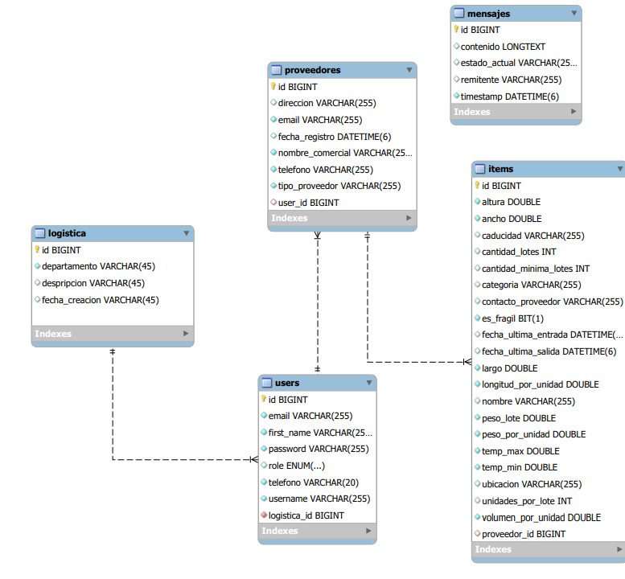

# Gestión de Ítems con Comunicación en Tiempo Real

## Descripción del Proyecto

Esta aplicación web demuestra el uso de la comunicación en tiempo real para la gestión de un flujo de ítems. Permite a diferentes usuarios interactuar en distintas etapas del ciclo de vida de un ítem: creación, envío y almacenamiento. La característica principal radica en la notificación instantánea a los usuarios relevantes cada vez que se realiza una acción sobre un ítem o cuando se genera un mensaje.

El backend implementa una API RESTful para la gestión de las entidades principales y utiliza WebSocket, STOMP y RabbitMQ para la comunicación en tiempo real. La seguridad se garantiza mediante autenticación y autorización con JWT tanto para los endpoints de la API como para las conexiones WebSocket.

El frontend es un cliente web construido con HTML, CSS y JavaScript puros, ofreciendo interfaces para el envío de datos y el inicio de sesión de usuarios.

## Funcionalidades Principales

1.  **CRUD y Endpoints para Entidades:**

    - Implementación completa de operaciones CRUD (Crear, Leer, Actualizar, Eliminar) para las siguientes entidades:
      - **Usuario:** Gestión de usuarios registrados.
      - **Proveedor:** Gestión de la información de proveedores.
      - **Ítem:** Gestión de los ítems en el sistema.
      - **Mensaje:** Gestión de los mensajes intercambiados entre usuarios.
      - **Logística:** Gestión de la información relacionada con el departamento de logística.
    - Cada entidad cuenta con sus propios endpoints RESTful para su manipulación.

2.  **Comunicación en Tiempo Real:**

    - Utilización de **WebSocket** y el protocolo **STOMP** para habilitar la comunicación bidireccional en tiempo real entre el backend y los clientes.
    - Integración con **RabbitMQ** como broker de mensajes para gestionar y distribuir eventos y notificaciones de manera eficiente.
    - Notificaciones en tiempo real a los usuarios cuando ocurre cualquier evento relevante en el sistema.

3.  **Autenticación y Autorización con JWT:**

    - Implementación de un sistema de autenticación basado en **JSON Web Tokens (JWT)** para asegurar la identidad de los usuarios.
    - Mecanismos de autorización para proteger tanto los endpoints de la API REST como los canales de comunicación WebSocket, garantizando que solo los usuarios autorizados puedan acceder a ciertas funcionalidades y datos.

4.  **Frontend con HTML, CSS y JavaScript:**
    - Cliente web desarrollado con **HTML**, **CSS** y **JavaScript** puros, sin el uso de frameworks o librerías complejas.
    - Interfaz para el **envío de datos**, permitiendo a los usuarios interactuar con las funcionalidades de la aplicación.
    - Página de **inicio de sesión** para que los usuarios registrados puedan acceder al sistema.

## Flujo Básico de la Aplicación

1.  **Creación de Entidades (Backend):** Inicialmente, las entidades base (usuarios, proveedores, logística) se pueden crear utilizando herramientas como Postman a través de los endpoints de la API REST.

2.  **Roles de Usuario:**

    - **USER:** Rol base para cualquier usuario registrado en el sistema.
    - **PROVEEDOR:** Un usuario puede actualizar su perfil para convertirse en proveedor, accediendo a funcionalidades específicas.
    - **LOGISTICA:** Un usuario puede crear una entidad de logística y, posteriormente, actualizar su perfil para formar parte de un "departamento de logística", obteniendo acceso a un cliente web específico.

3.  **Acceso al Cliente (Frontend):** Cada usuario, según su rol y departamento de logística asignado, ingresa a una interfaz de cliente web personalizada.

4.  **Conexión WebSocket:** Al acceder al cliente, se establece una conexión WebSocket con el backend, permitiendo la comunicación en tiempo real.

5.  **Mensajes:** La comunicación entre los diferentes clientes (usuarios) genera la creación de la entidad **Mensaje** en el backend.

6.  **Ítem:** La entidad **Ítem** se crea finalmente cuando los datos relevantes de un **Mensaje** son mapeados y persistidos en el sistema.

## Tecnologías Utilizadas

**Backend:**

- **JavaEE:** Plataforma de desarrollo empresarial Java.
- **SpringBoot:** Framework de Java para la creación rápida de aplicaciones independientes y de nivel de producción.
- **MySQL:** Sistema de gestión de bases de datos relacional.
- **WebSocket:** Protocolo de comunicación bidireccional en tiempo real sobre una única conexión TCP.
- **STOMP (Simple Text Oriented Messaging Protocol):** Protocolo de mensajería simple para trabajar con WebSockets.
- **RabbitMQ:** Broker de mensajes robusto y escalable (ejecutado en un contenedor de Docker).
- **JWT (JSON Web Tokens):** Estándar abierto basado en JSON para la creación de tokens de acceso seguros.
- **Junit:** Framework de pruebas unitarias para Java.
- **Mockito:** Framework de mocking para pruebas unitarias en Java.

**Frontend:**

- **HTML:** Lenguaje de marcado para la estructura del contenido web.
- **CSS:** Lenguaje de hojas de estilo para la presentación visual de documentos HTML.
- **JavaScript:** Lenguaje de programación para la interactividad del frontend.
- **Node.js:** Entorno de ejecución de JavaScript utilizado para crear un servidor web simple y servir los archivos del cliente, evitando problemas de CORS con el backend durante el desarrollo.

## Configuración e Instalación

Para ejecutar la aplicación en tu entorno local, sigue estos pasos:

1.  **Requisitos Previos:**

    - Java Development Kit (JDK) 8 o superior.
    - Maven (para la construcción del backend).
    - Node.js y npm (para el servidor web del frontend).
    - Docker (para ejecutar RabbitMQ).
    - MySQL instalado y en ejecución.

2.  **Configuración del Backend:**

    - Clona el repositorio del backend.
    - Configura la conexión a la base de datos MySQL en el archivo de configuración de Spring Boot (`application.properties). Asegúrate de crear la base de datos (Las tablas se crearan automaticamente).
    - **Docker para RabbitMQ:** Asegúrate de tener Docker instalado y en ejecución. Ejecuta el contenedor de RabbitMQ con la versión 4.x y la interfaz de administración utilizando el siguiente comando:

      ```bash
      # latest RabbitMQ 4.x
      docker run -it --rm --name rabbitmq -p 5672:5672 -p 15672:15672 rabbitmq:4-management
      ```

      Este comando iniciará RabbitMQ en un contenedor llamado `rabbitmq`, exponiendo el puerto estándar de RabbitMQ (5672) y el puerto de la interfaz de administración web (15672). La opción `--rm` eliminará el contenedor cuando se detenga, y `-it` permite una sesión interactiva (aunque puedes ejecutarlo en segundo plano con `-d` si lo prefieres una vez que esté configurado).

    - **Instalación del Plugin STOMP en RabbitMQ:** Para habilitar la comunicación STOMP, es necesario activar el plugin correspondiente en RabbitMQ. Esto se puede hacer fácilmente utilizando la interfaz de administración web.

      1.  Abre tu navegador web y ve a `http://localhost:15672`.
      2.  Inicia sesión con las credenciales por defecto (normalmente `guest/guest`). **Es altamente recomendable cambiar estas credenciales en un entorno de producción.**
      3.  Navega a la sección "Admin" y luego a "Plugins".
      4.  Busca el plugin `rabbitmq_stomp` y haz clic en el botón "Enable".

    - Construye el proyecto del backend utilizando Maven:
      ```bash
      cd backend
      mvn clean install
      ```
    - Ejecuta la aplicación Spring Boot:
      ```bash
      mvn spring-boot:run
      ```

3.  **Configuración del Frontend:**
    - Clona el repositorio del frontend.
    - Navega al directorio del frontend:
      ```bash
      cd websocket-client
      ```
    - **Servidor Web con Node.js y Express:** Para servir los archivos estáticos del frontend y evitar problemas de CORS durante el desarrollo, se utiliza un servidor web simple construido con Node.js y la librería `express`. Asegúrate de tener Node.js y npm instalados.
    - **Instalar la dependencia:** Si aún no lo has hecho, puedes instalar la dependencia `express` ejecutando el siguiente comando en la raíz del proyecto frontend:
      ```bash
      npm install express
      ```
    - **Ejecutar el servidor:** El servidor se inicia desde la terminal, ubicado en la raíz del proyecto frontend, utilizando el siguiente comando:
      ```bash
      node server.js
      ```
      **Nota:** Asegúrate de que exista un archivo llamado `server.js` en la raíz de tu proyecto frontend que contenga la configuración del servidor Express. Este archivo debería ser responsable de servir tus archivos HTML, CSS y JavaScript.
    - Abre tu navegador web y navega a la dirección donde se sirve el frontend (por ejemplo, `http://localhost:8080` o la dirección y puerto que hayas configurado en `server.js`).

## Endpoints de la API

**_USUARIO_**

- `POST /auth/register`: Crear un nuevo usuario.
- `POST /auth/login`: Ingresa a la app con un usuario autenticado.
- `GET /api/v1/user/{id}`: Obtener información de un usuario por su ID.
- `GET /api/v1/usuarios/{id}`: Actualizar información de un usuario.
- `DELETE /api/v1/user/{id}`: Eliminar un usuario.

**_PROVEEDOR_**

- `POST /api/v1/proveedor`: Crear un nuevo proveedor.
- `GET /api/v1/proveedores`: Obtiene todos los proveedores.

**_ITEM_**

- `GET /api/v1/item{id}`: Obtener un item por su ID.
- `POST /api/v1/item`: Crear un nuevo item.
- `POST /api/v1/descontar`: Descuenta una cantiad de un item registrado.
- `GET /api/v1/item/items`:Obtiene todos los items.
- `DELETE /api/v1/item/{id}`: Elimina un item por su ID.

**_LOGISTICA_**

- `POST /api/v1/logistica/perfil`: Actualiza el rol de un usuario existente a LOGISTICA y lo añade a un departamento.
- `GET /api/v1/logistica/{id}`: Obtiene una entidad logistica por su ID.
- `GET /api/v1/logistica/todos`: Obtener todas las entidades logistica.
- `POST /api/v1/logistica`: Crea una nueva entidad logistica.
- `DELETE /api/v1/logistica/{id}`: Elimina una entidad logistica por su ID.

## Diagrama Entidad-Relación (DER)

A continuación, se muestra el diagrama entidad-relación que representa la estructura de la base de datos de la aplicación:


